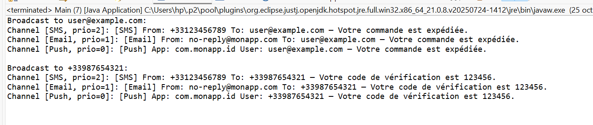

# TP 8 : Interfaces 

## Exercice 1 : Système de paiement extensible

### Objectifs pédagogiques
- Comprendre le rôle des **interfaces** en Java pour définir des contrats indépendants des implémentations.
- Découpler le code métier (`PaymentProcessor`) des détails de chaque moyen de paiement.
- Mettre en pratique l’**agrandissement dynamique** d’un tableau pour stocker des objets hétérogènes.
- Renforcer la capacité d’**extension** : ajouter un nouveau moyen de paiement sans modifier le processeur.

---

### Modélisation

#### Interface `PaymentMethod`
Responsabilité : tout moyen de paiement doit savoir :
- payer (`pay`)
- rembourser (`refund`)
- se présenter (`getName`)

#### Implémentations concrètes
| Classe      | Spécificité                 |
|------------|-----------------------------|
| `CreditCard` | numéro, titulaire, solde simulé |
| `PayPal`     | email, solde simulé          |
| `Bitcoin`    | wallet, solde simulé         |

#### Gestionnaire `PaymentProcessor`
- Stocke un tableau de `PaymentMethod` qui s’agrandit automatiquement  
- Pour un montant donné, tente un paiement puis rembourse la moitié


### Sortie attendue (exemple) :

```bash
=== Traitement des paiements de 100.00 ===
-> Via CreditCard[Alice Dupont]
CreditCard (Alice Dupont) : payé 100.00, reste 400.00
CreditCard (Alice Dupont) : remboursé 50.00, solde 450.00

-> Via PayPal[bob@example.com]
PayPal (bob@example.com) : payé 100.00, reste 100.00
PayPal (bob@example.com) : remboursé 50.00, solde 150.00

-> Via Bitcoin[1A2b3C4d5E]
Bitcoin (1A2b3C4d5E) : fond insuffisant (0.10)<100.00>

```

## Exemple d’exécution (image)

Voici un exemple de l'exécution du programme (screenshot) :


## Exercice 2 : Système de Notification Extensible

### Introduction
Les interfaces en Java permettent de définir des contrats sans imposer d’implémentation.  
Ce TP guide la création d’un système de notification où différents canaux (Email, SMS, Push) implémentent une même interface, et un gestionnaire (`NotificationManager`) diffuse des messages sans connaître les détails des canaux.

---

### 1. Objectifs pédagogiques
- Définir et implémenter une interface Java (`Notification`).  
- Découpler la logique métier de l’envoi de notifications des canaux concrets.  
- Gérer un tableau dynamique d’objets hétérogènes implémentant la même interface.  
- Appliquer le tri avec un critère exposé par l’interface (priorité).

---

### 2. Spécifications fonctionnelles

#### Interface `Notification`
- `send(String recipient, String message)`  
- `int getPriority()` : 0 (basse), 1 (normale), 2 (haute)  
- `String getType()`

#### Implémentations
| Classe | Priorité | Description |
|--------|----------|-------------|
| `EmailNotification` | 1 (normale) | Envoie un mail simulé |
| `SMSNotification`   | 2 (haute)  | Envoie un SMS simulé |
| `PushNotification`  | 0 (basse)  | Envoie une notification push simulée |

#### Gestionnaire `NotificationManager`
- Stocke un tableau dynamique de `Notification`  
- `addChannel(Notification)` : enregistrer un canal  
- `broadcast(recipient, message)` :  
  - Trier les canaux par priorité décroissante  
  - Appeler `send(...)` sur chacun

#### Programme de test `Main`
- Instancie plusieurs méthodes  
- Les enregistre dans le processeur  
- Exécute les transactions

  
#### Programme principal `Main`
- Crée et enregistre plusieurs canaux  
- Diffuse plusieurs messages à des destinataires variés

---

### Sortie attendue (exemple) :


``` bash

Broadcast to user@example.com:
Channel [SMS, prio=2]: [SMS] From: +33123456789 To: user@example.com — Votre commande est expédiée.
Channel [Email, prio=1]: [Email] From: no-reply@monapp.com To: user@example.com — Votre commande est expédiée.
Channel [Push, prio=0]: [Push] App: com.monapp.id User: user@example.com — Votre commande est expédiée.

Broadcast to +33987654321:
Channel [SMS, prio=2]: [SMS] From: +33123456789 To: +33987654321 — Votre code de vérification est 123456.
Channel [Email, prio=1]: [Email] From: no-reply@monapp.com To: +33987654321 — Votre code de vérification est 123456.
Channel [Push, prio=0]: [Push] App: com.monapp.id User: +33987654321 — Votre code de vérification est 123456.


```

## Exemple d’exécution (image)

Voici un exemple de l'exécution du programme (screenshot) :




---

### Diagramme de classes UML simplifié

